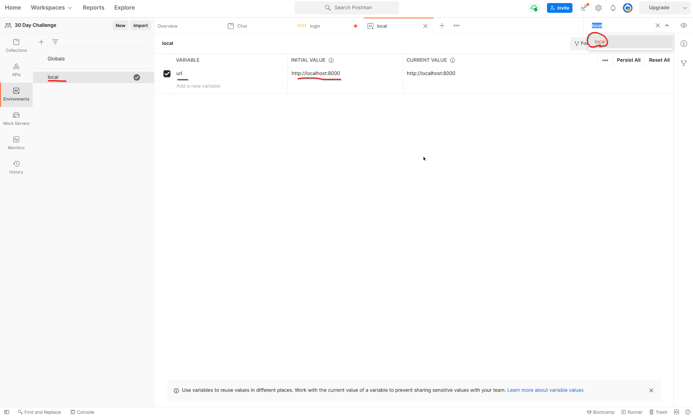
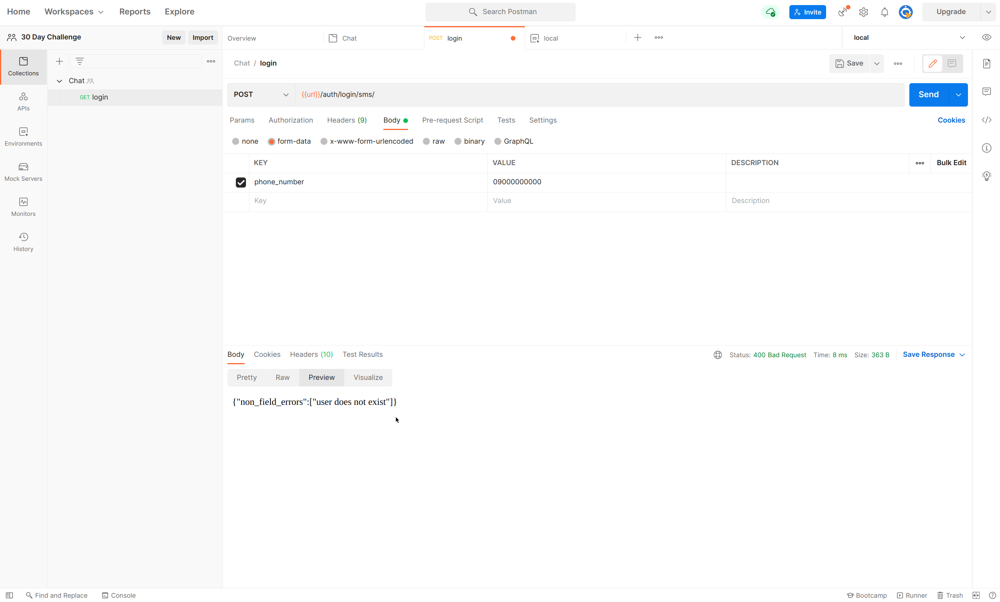
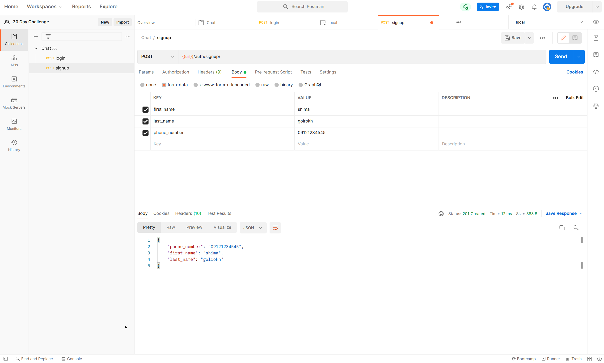
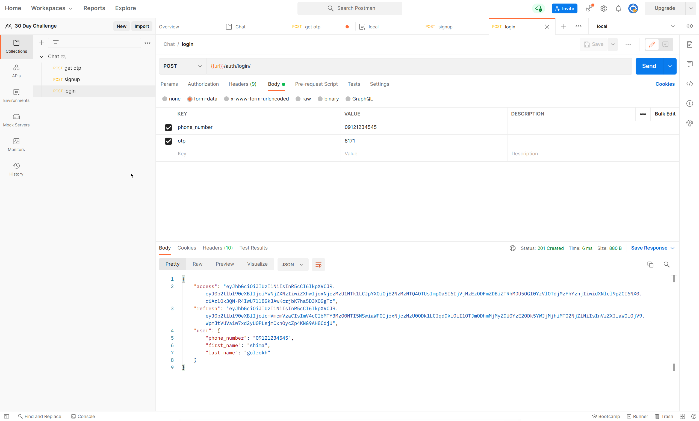

# point 
```python
class User(AbstractUser):

    username = None
    phone_number = models.CharField(max_length=16,
                                    unique=True, null=True, default=None)
class OTP(models.Model):
    user = models.ForeignKey(User, on_delete=models.CASCADE) # integer => user.id = 2
```

user isnt phone_number ,phone_number = user.phone_number

### or (pk=True in phone_number field)
```python
class User(AbstractUser):

    username = None
    phone_number = models.CharField(max_length=16,
                                    unique=True, null=True, default=None, primary_key=True)
class OTP(models.Model):
    user = models.ForeignKey(User, on_delete=models.CASCADE) # char field => user.phone_number = 0912...
```


# GetOtp 
* phone_number,password ( like Calender App)
  * login, refresh => simple-jwt 
  * signup => we write that
  
* phone_number,Otp

### front
1. user Enetr phone_number 

### backend
2. get user(phone_number) and check phone_number is valid
3. create Otp
4. send Sms

### front
5. user Enter Otp => Otp + phone_number send to back

# Test on postman
* create workspace
* create chat collection
* create environment => local
### add environment


## Get Token Postman Test
### before login you must signup or create user in admin panel


### create user in admin panel


check admin panel and see OTP


### backend

6. check OTP belongs to phone_number
7. generate access and refresh token


# SignUp
### front 
1. user Enter first,last,phone_numer

### backend
2. create user 
3. create otp
4. send otp

## Signup Postman Test



### front 
5. user Enter Otp => Otp + phone_number send to back

### backend
6. check OTP belongs to phone_number
7. generate access and refresh token


# login
user and otp exist and test otp blongs to user

1. get user and otp and check for blonging
```python
class LoginSerializer(serializers.Serializer):
    phone_number = serializers.CharField(write_only=True)
    otp = serializers.CharField(write_only=True)

    def validate(self, attrs):
        phone_number = attrs['phone_number']
        otp = attrs['otp']
        try:
            user = User.objects.get(phone_number=User.phone_number)
            otp = OTP.objects.get(user=user,is_active=True,value=otp,exp_date__gte=datetime.now())
            attrs['user'] = user
        except User.DoesNotExist:
            raise serializers.ValidationError("user does not exist")
        except OTP.DoesNotExist:
            raise serializers.ValidationError("OTP does not exist")

```

2.  pip install djangorestframework-simplejwt
3. Create access/refresh token for user
   * How does simplejwt create access/token
```python
from rest_framework_simplejwt.views import TokenObtainPairView # create access/refresh

# in view
class TokenObtainPairView(TokenViewBase):
    """
    Takes a set of user credentials and returns an access and refresh JSON web
    token pair to prove the authentication of those credentials.
    """

    _serializer_class = api_settings.TOKEN_OBTAIN_SERIALIZER
# in api settings
rest_framework_simplejwt.serializers.TokenObtainPairSerializer
# serializer


class TokenObtainSerializer(serializers.Serializer):
    ...

    @classmethod
    def get_token(cls, user):
        return cls.token_class.for_user(user)


class TokenObtainPairSerializer(TokenObtainSerializer):
    token_class = RefreshToken

    def validate(self, attrs):
        ...
        refresh = self.get_token(self.user)

        data["refresh"] = str(refresh)
        data["access"] = str(refresh.access_token)

        ...

        return data

```

  * We realize RefreshToken.for_user => returns access/refresh
  * Now we create access/refresh for user

```python


class LoginSerializer(serializers.Serializer):
    phone_number = serializers.CharField(write_only=True)
    otp = serializers.CharField(write_only=True)

    def validate(self, attrs):
        phone_number = attrs['phone_number']
        otp = attrs['otp']
        try:
            user = User.objects.get(phone_number=User.phone_number)
            otp = OTP.objects.get(user=user,is_active=True,value=otp,exp_date__gte=datetime.now())
            attrs['user'] = user
        except User.DoesNotExist:
            raise serializers.ValidationError("user does not exist")
        except OTP.DoesNotExist:
            raise serializers.ValidationError("OTP does not exist")

        tokens = RefreshToken.for_user(user)

        # refresh = str(tokens)
        # access = str(tokens.access_token)

        attrs['refresh'] = str(tokens)
        attrs['access'] = str(tokens.access_token)

        # return user,refresh,access
        return attrs
```
4. Add fields to serializer

```python
class LoginSerializer(serializers.Serializer):
    ...
    access = serializers.CharField(read_only=True)
    refresh = serializers.CharField(read_only=True)
    user = UserSerializer(read_only=True)
```

## Login Postman Test
### get otp for user because otp is expired

View OTP in admin

