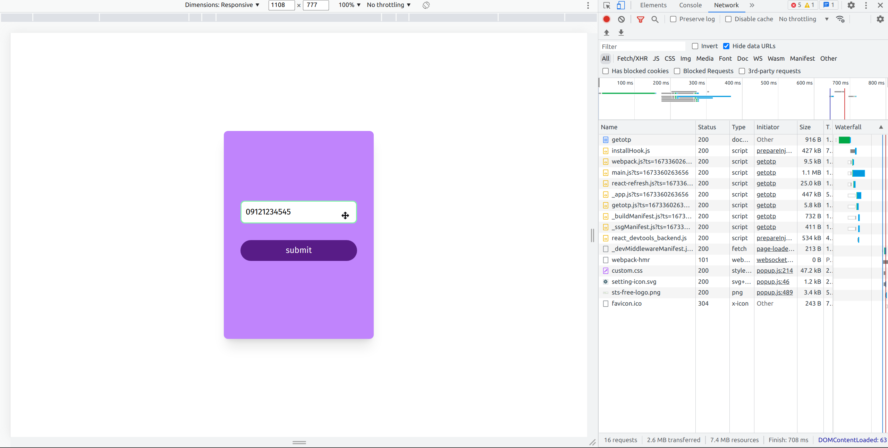
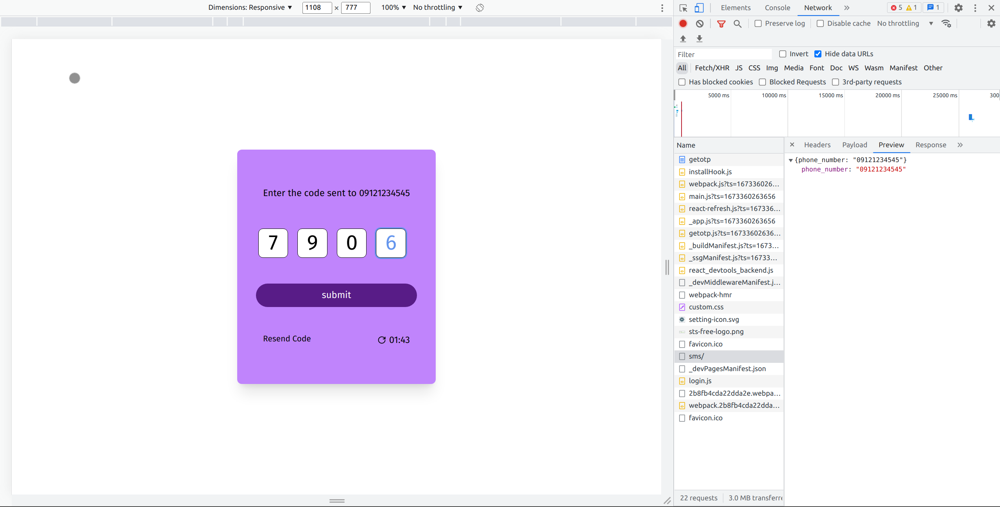
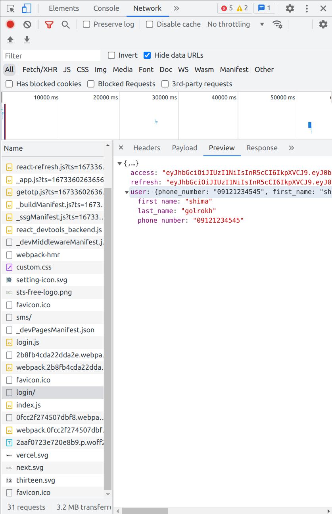

# Chat


# Authentication
## How to get phone number in login page
1. Save phone number in getotp/signup
```jsx
builder.addCase(getOtp.fulfilled, (state, action) => {
  state.loading = false;
  state.phone_number = action.payload.data.phone_number
  return state;
});

builder.addCase(signup.fulfilled, (state, action) => {
  state.loading = false;
  state.phone_number = action.payload.data.phone_number
  return state;
});
```
2. Get phone number from redux
```jsx
const phone = useSelector(state=>state.authReducer?.phone_number)

const router = useRouter()
const submit =async()=>{
  try {
    await dispatch(login({phone_number:phone, otp: code})).unwrap()
    router.push('/')
  } catch (error) {
    console.log(error)
  }
}
```
### getotp

### login

### after login


# Timer(setInterval in react)
1. Create a set interval
```jsx
const [time, setTime] = useState(120)
const startTimer = () => {
  setInterval(() => {
    setTime(...)
  }, 1000)
}
```
2. Start timer when page loads
```jsx
const startTimer = () => {
  setInterval(() => {
    setTime(...)
  }, 1000)
}
useEffect(() => {
  startTimer();

  return () => {

  }
})
```

3. Stop timer after exiting page
  * We want to stop setInterval
  * In order to save interval value, we use refs
```jsx
const timerRef = useRef()
const startTimer = () => {
  const interval = setInterval(() => {
    setTime(...)
  }, 1000)
  timerRef.current = interval;
}
useEffect(() => {
  startTimer();

  return () => {
    if (timerRef.current) clearInterval(timerRef.current)
  }
})
```
4. Update time in Interval
  * Problem
```jsx
const [time, setTime] = useState(120);

const startTimer = () => {
  const timerInterval = setInterval(() => {
    console.log(time)
    setTime(time - 1);
  }, 1000);
  timerRef.current = timerInterval;
};
```
  * timer stuck on 119, because setInterval function was created when `time==120` and it doesn't update time afterwards
  * Solution: Use function for updating value(React syntax)

```jsx

const startTimer = () => {
  const timerInterval = setInterval(() => {
    setTime((t) => (t > 0 ? t - 1 : t)); // t is the current value for time
  }, 1000);
  timerRef.current = timerInterval;
};
```