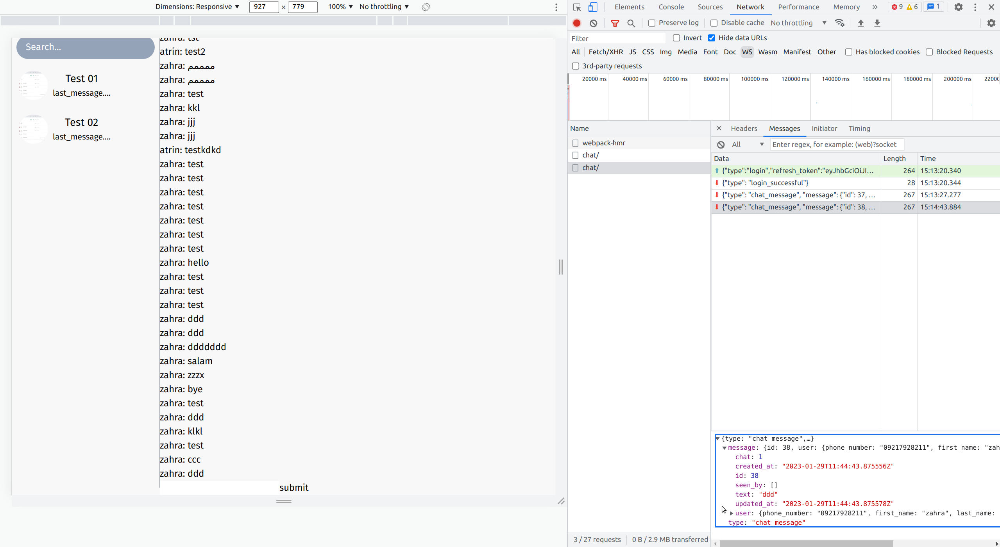

# Show messages in their own room
## task
When a message is sent, it will be added to message list, even if it's not for this chat. So messages will be shown in any chat.


## Done!

```jsx

e =>  const msg = JSON.parse(e.data)

msg = {
  message: {
    chat:1,
    created_at:"2023-01-29T11:50:34.138292Z",
    id:43,
    seen_by:[],
    text:"11",
    updated_at:"2023-01-29T11:50:34.138311Z",
    user:{phone_number: "09217928211", first_name: "zahra", last_name: "farrokhi"},
    first_name:"zahra",
    last_name:"farrokhi",
    phone_number:"09217928211",
  },
  type:"chat_message"
},

msg.message.chat => 1

if (msg.message.chat==chat.id){ dispatch(addMsg(msg.message))}

```

# Show different colors for messages based on sender
## task
Show messages sent from the current user in one side with different colors.
## Done!
```jsx
{/* direction */}
 <div className={`flex flex-col justify-center ${user?.phone_number == msg.user.phone_number ? "items-end":"items-start"} gap-2`} key={msg.id}>
{/* color */}
 <span className={`${user?.phone_number == msg.user.phone_number ? "bg-emerald-300" : "bg-green-200"} rounded-xl p-3 max-w-[80%] md:min-w-[400px]`}>{msg.text}</span>
```

# Scroll to bottom when a new message arives
## task
When a new message comes, scroll to bottom.
## Done!
```jsx
// 1.
const messageContainer = useRef()

// 2.
<div className="w-full h-full flex flex-col gap-2 overflow-auto pb-12" ref={messageContainer} />

// 3. 
if (msg.type == "chat_message") {
  if (msg.message.chat == chat.id) {
    dispatch(addMsg(msg.message));

    // Scroll to bottom of container
    messageContainer.current.scrollTo({
      top: messageContainer.current.scrollHeight,
      behavior: 'smooth'
    })
  }
}

```

# Scroll function doesn't scroll to the last message
## task
After scrolling, it goes to the second to last message, the last message is still outside the view

## Description
React doesnt update the ui until all state updates are finished, so after running the following:
```jsx
dispatch(addMsg(msg.message));

// Scroll to bottom of container
messageContainer.current.scrollTo({
  top: messageContainer.current.scrollHeight,
  behavior: 'smooth'
})
```
It first scrolls to the bottom, then adds the new message in the ui, so it doesn't scroll to the end. 

In order to fix this issue we use flushSync function that forces react to update the ui.

## Done!
```jsx
flushSync(() => {
  dispatch(addMsg(msg.message));
})
messageContainer.current.scrollTo({
  top: messageContainer.current.scrollHeight,
  behavior: 'smooth'
})
```

# Send message on enter
## task
Send message on enter
## Done!
```jsx
<form ... onSubmit={createMsg}> {/* Change div to form, add onSubmit */}
  <button type="submit" {/* remove onClick and add type="submit" */}
  >
  </button>
</form>


const createMsg = async (e) => { // Take event as input parameter
  e.preventDefault() // prevent page reload on submit

}
```