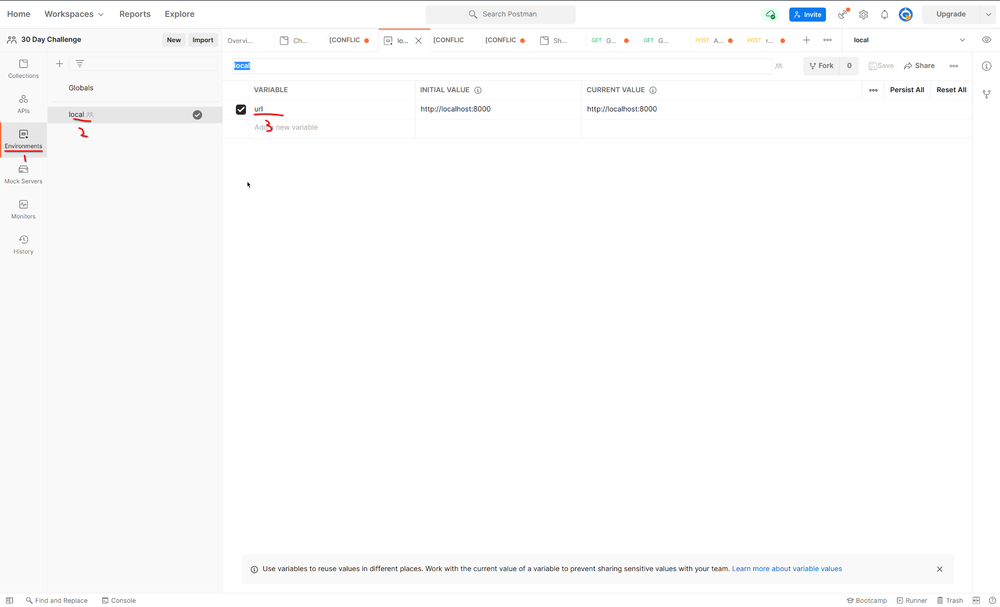
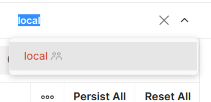
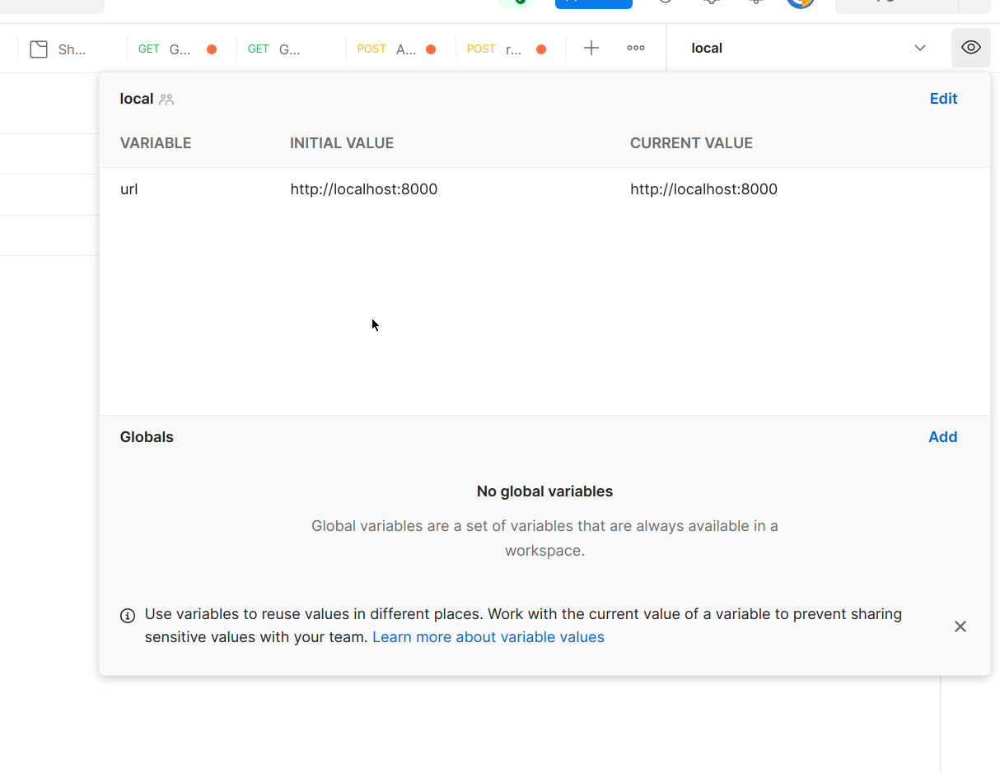
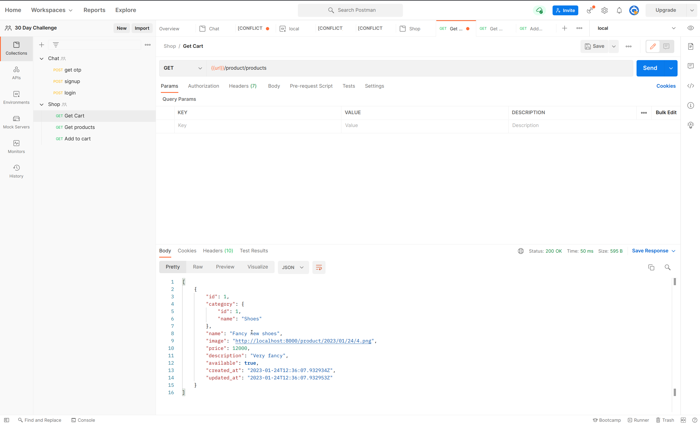
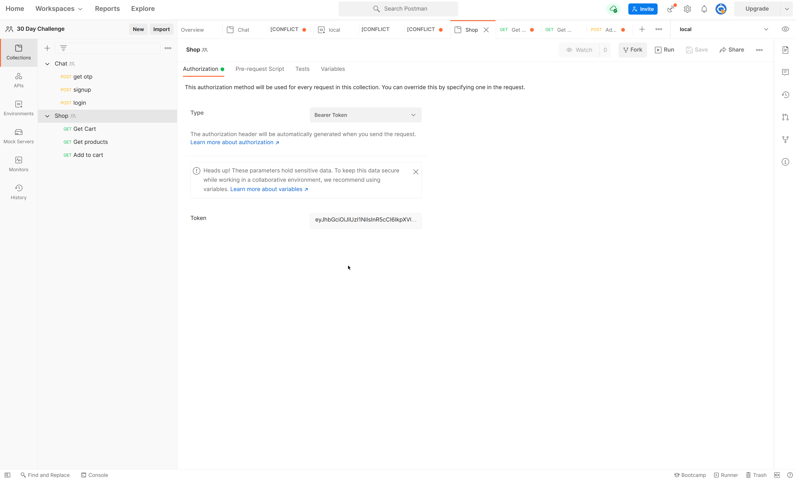
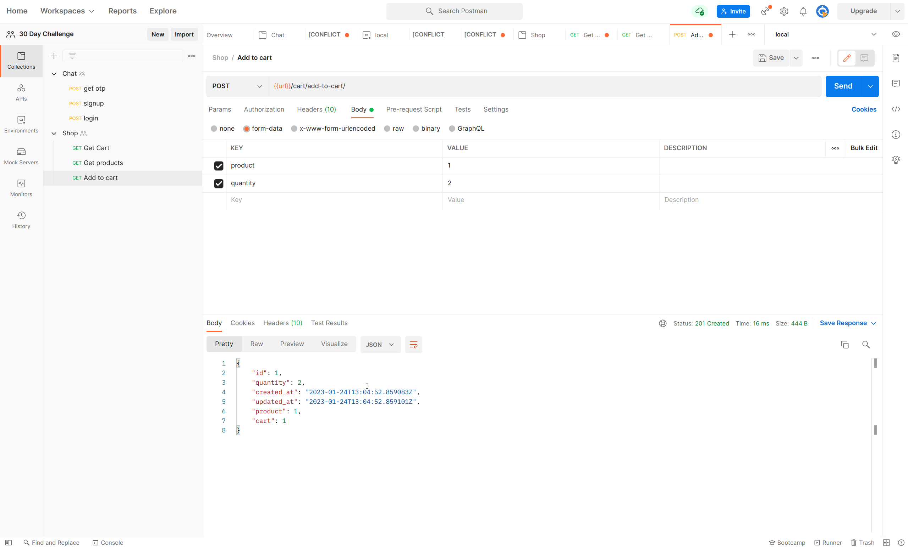
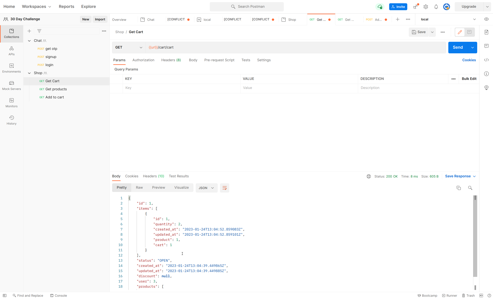
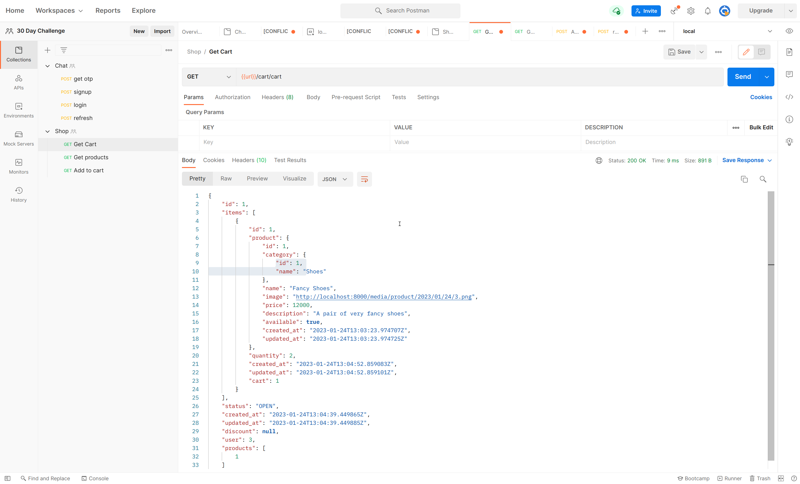

# Setting up postman environment
1. Go to environments tab
2. Create a new environment 
3. Add url to environment variables



4. Save and Select environment




5. You can view environment in the eye button



# Create superuser
```bash
python3 manage.py createsuperuser
```
# Get Product List



# Add authentication
1. User chat authentication postman to login
2. Add access token to collection authentication


# Add product to cart
## Error: cart is required

* In CartItemSerializer, make cart readonly
```python
class CartItemSerializer(serializers.ModelSerializer):
    class Meta:
        model = CartItem
        fields = '__all__'
        read_only_fields = ['cart']
    ...
```

## Successful


# Get Cart



# Nesting product in cart
```python
class CartItemSerializer(serializers.ModelSerializer):
    product = ProductSerializer()
    ...
```
