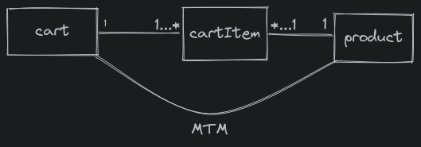

## cartItem fk to cart & products


```python
from django.contrib.auth.models import User
from product.models import Product


# Create your models here.
class Cart(models.Model):

   
    class Status(models.TextChoices):
        open = 'OPEN', 'open'
        closed = 'CLOSED', 'closed'

    status = models.CharField(choices=Status.choices, max_length=20, default=Status.open)
    created = models.DateTimeField(auto_now_add=True)
    updated = models.DateTimeField(auto_now=True)
    discount = models.IntegerField(blank=True, null=True, default=None)
    user = models.ForeignKey(User, on_delete=models.CASCADE, related_name='carts', related_query_name='cart')

  
class CartItem(models.Model):
    quantity = models.IntegerField(default=0)
    product = models.ForeignKey(Product, on_delete=models.CASCADE, related_name='carts', related_query_name='cart')
    cart = models.ForeignKey(Cart, on_delete=models.CASCADE, related_name='items', related_query_name='item')

   


```

### cart mtm cartItem 

```python
class Cart(models.Model):
  
    class Status(models.TextChoices):
        open = 'OPEN', 'open'
        closed = 'CLOSED', 'closed'

    status = models.CharField(choices=Status.choices, max_length=20, default=Status.open)
    created = models.DateTimeField(auto_now_add=True)
    updated = models.DateTimeField(auto_now=True)
    discount = models.IntegerField(blank=True, null=True, default=None)
    user = models.ForeignKey(User, on_delete=models.CASCADE, related_name='carts', related_query_name='cart')
    # MTM
    products = models.ManyToManyField(Product,through="CartItem")
  


class CartItem(models.Model):
    quantity = models.IntegerField(default=0)
    product = models.ForeignKey(Product, on_delete=models.CASCADE, related_name='carts', related_query_name='cart')
    cart = models.ForeignKey(Cart, on_delete=models.CASCADE, related_name='items', related_query_name='item')

   

```