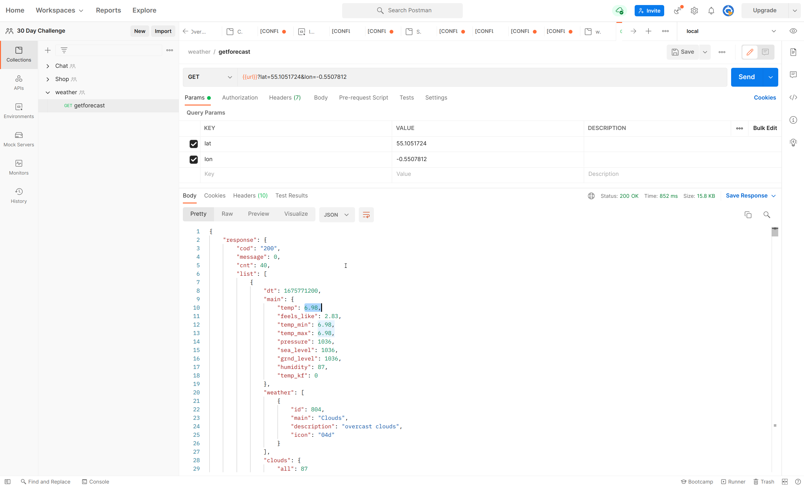
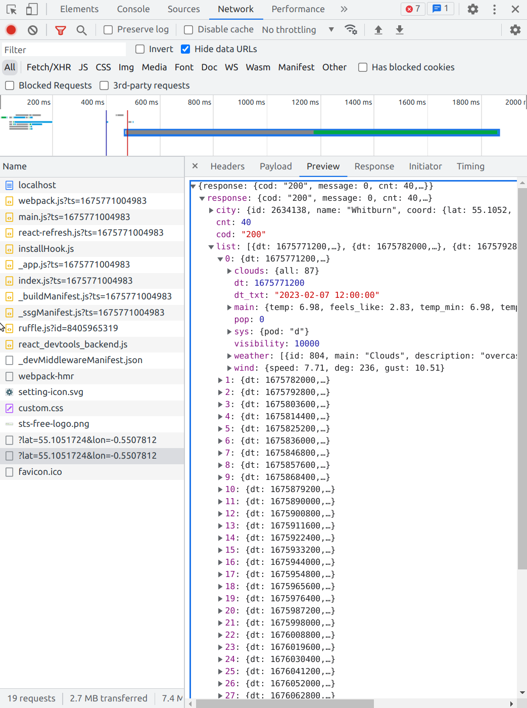
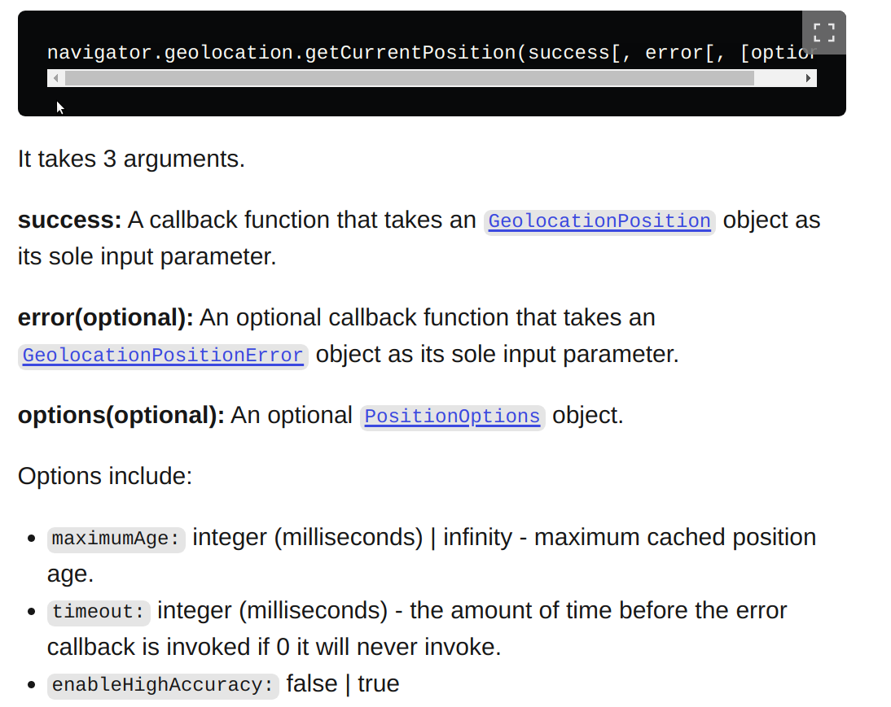
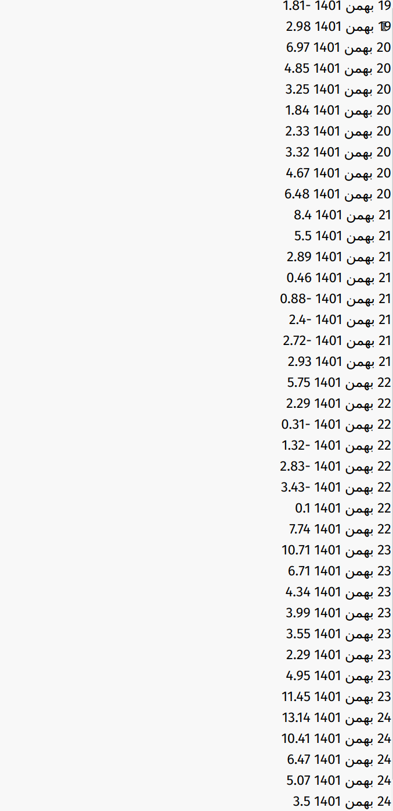
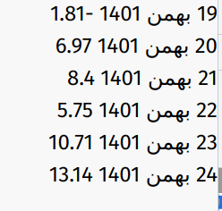
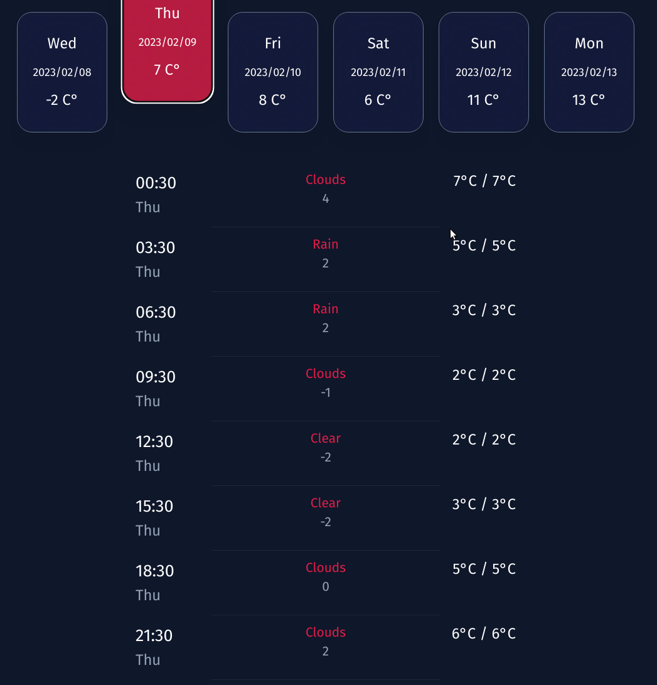

# backend 
1. weather api => https://openweathermap.org/api
2. Write api
```python
class GetWeather(APIView):

    def get(self,request):
        try:
            lat = request.GET['lat']
            lon = request.GET['lon']
            response = requests.get('https://api.openweathermap.org/data/2.5/forecast', {
                'lat' : lat,
                'lon': lon,
                'appid':'xxxxxxxxxxxxxxxxxx',
                'units': 'metric',
            })

            return Response({'response':response.json()}, status=status.HTTP_200_OK)
        except Exception as e:
            print(e)
            return Response({'message':'the weather not found'}, status=status.HTTP_500_INTERNAL_SERVER_ERROR)


```
3. env
```python
# pip install django-environ
import environ


env = environ.Env(
    # You can set default values here
    DEBUG=(bool, False)
)
environ.Env.read_env()

# views.py
 'appid':settings.API_KEY,

```
4. postman


## Adding caching so that backend doesn't send a request to weather service on every request
```python
from django.utils.decorators import method_decorator
from django.views.decorators.cache import cache_page

class GetWeather(APIView):

    @method_decorator(cache_page(60*60*2)) # Refresh every two hours
    def get(self,request):
      ...
```
# frontend
1.
```jsx
export default function Home() {

  const [data, setData] = useState();
  const getData = async ()=>{
    try {
      const response = await axios.get('http://localhost:8000', {params:{lat:'55.1051724',lon:'-0.5507812'}})
      setData(response.data)
    } catch (error) {
      console.error(error)
    }
  }
 
  useEffect(()=>{
    getData()
  },[])
  return (
    <>
    
    </>
  )
}
```

2. Load data (map)
```jsx
    {data?.response.list.map((day)=><div>{day.dt} {day.main.temp}</div>)}
 
```
3. Format time
```jsx
import moment from 'moment'


 moment.unix(day.dt).format("YYYY-MM-DD")
```
4. Format Jalali
```jsx

import moment from 'moment-jalaali'

 moment.unix(day.dt).format("jDD jMMMM jYYYY") // 12 Bahman 1401
 
// Use persian dialect
moment.loadPersian()
 moment.unix(day.dt).format("jDD jMMMM jYYYY") // ۱۲ بهمن ۱۴۰۱

```
5. How to get user’s location with React JS
*** allow => point is getData() 
```python
  useEffect(()=>{
    if (navigator.geolocation) {
      navigator.permissions
        .query({ name: "geolocation" })
        .then(function (result) {
          if (result.state === "granted") {
            console.log(result.state);
            getData()
            //If granted then you can directly call your function here
          } else if (result.state === "prompt") {
            console.log(result.state);
          } else if (result.state === "denied") {
            //If denied then you have to show instructions to enable location
          }
          result.onchange = function () {
            if (result.state === "granted") {
              console.log(result.state);
              getData()
            }
          };
        });
    } else {
      alert("Sorry Not available!");
    }

   
  },[])
```
*** current position



```jsx
// Update geolocation to load the data when user location is available
  useEffect(()=>{
    if (navigator.geolocation) {
      navigator.permissions
        .query({ name: "geolocation" })
        .then(function (result) {
          if (result.state === "granted") {
            console.log(result.state);
            navigator.geolocation.getCurrentPosition(getData) // getCurrentPosition takes a function(position) {} as first parameter
            
            //If granted then you can directly call your function here
          }
          ...
          
// Get user position in params
  const getData = async (pos)=>{
    const crd = pos.coords; // Get coordinates
    try {
      const response = await axios.get('http://localhost:8000', {params:{lat:crd.latitude,lon:crd.longitude}}) // use coordinates for lat/lon
      setData(response.data)
    } catch (error) {
      console.error(error)
    }
  }
 
```

## Example map
* Data format
```json
{
  "response": {
    "cod": "200",
    "message": 0,
    "cnt": 40,
    "list": [
      {
        "dt": 1675857600,
        "main": {
          "temp": -1.17,
          "feels_like": -3.78,
          "temp_min": -1.17,
          "temp_max": 1.01,
          "pressure": 1024,
          "sea_level": 1024,
          "grnd_level": 970,
          "humidity": 57,
          "temp_kf": -2.18
        },
        "weather": [
          {
            "id": 801,
            "main": "Clouds",
            "description": "few clouds",
            "icon": "02n"
          }
        ],
        "clouds": {
          "all": 23
        },
        "wind": {
          "speed": 1.97,
          "deg": 20,
          "gust": 1.96
        },
        "visibility": 10000,
        "pop": 0,
        "sys": {
          "pod": "n"
        },
        "dt_txt": "2023-02-08 12:00:00"
      },
      ...
    ],
    "city": {
      "id": 4269447,
      "name": "Cheney",
      "coord": {
        "lat": 37.751,
        "lon": -97.822
      },
      "country": "US",
      "population": 2094,
      "timezone": -21600,
      "sunrise": 1675862938,
      "sunset": 1675900922
    }
  }
}

```

* Example: Get weather status(cloudy/sunny/rain) for each entry
```js
data.response.list.map((day) => day.weather.map(w => w.main))
// Response
[
    ['cloudy'],
    ['cloudy'],
    ['sunny'],
    ['rain'],
    ....
]
```

* Example: Get Weather for 12PM each day
```js
data.response.list.filter(day => day.dt === '12')
data.response.list.filter(day => moment.unix(day.dt).format("HH") === '00')

```

* Example: Get Feels like temperature for each day at 12PM
```js
data.response.list.filter(day => moment.unix(day.dt).format("HH") === '00').map(day => day.main.feels_like)
[
   12.1,
   -9
   ...
]

```
* Example: Get Feels like temperature for each day at 12PM And remove decimal point
```js
data.response.list.filter(day => moment.unix(day.dt).format("HH") === '00').map(day => day.main.Math.round(feels_like)) // Wrong!!


data.response.list.filter(day => moment.unix(day.dt).format("HH") === '00').map(day => Math.round(day.main.feels_like))

```

### Cloud animation
```css

.move-rtl {
  animation: bg-animation 10s ease  infinite forwards;

}

@keyframes bg-animation {
  0% {
    left: 0%;
    transform: translate(-100%, 0);
  }
  100% {
    left: 100%;
    transform: translate(100%, 0);

  }
}
```
```jsx
// We can use [animate-delay:...] from tailwind to set animation delay and add ! to make it important
<AiFillCloud className="text-slate-700 move-rtl absolute text-2xl top-10 w-32 h-32" />
<AiFillCloud className="text-slate-700 move-rtl absolute ![animation-delay:300ms] text-2xl top-15 w-16 h-16" />
<AiFillCloud className="text-slate-700 move-rtl absolute ![animation-delay:2s] text-2xl top-4 w-16 h-16" />
<AiFillCloud className="text-slate-700 move-rtl absolute ![animation-delay:1s] text-2xl top-20 w-20 h-20" />

```

### Task: Show only one weather for each date
* Problem: There were multiple data for each day



```
    {data?.response.list.map((day)=><div dir="rtl"><span>{moment.unix(day.dt).format("jDD jMMMM jYYYY")}</span> <span>{day.main.temp}</span></div>)}

```
* Solution: Only show dates that are different from the previous item
```
2022-01-12 * Show 
2022-01-12
2022-01-13 * Show
2022-01-13
2022-01-13
2022-01-13
2022-01-14 * Show
2022-01-14
2022-01-14

```
We use filter to remove unnecessary items:
```
    {data?.response.list.filter(
            (day, ind, arr) =>
              ind == 0 || // index -1 doesn't work in js, so we need to skip 0
              // 20 !== 21 show 20 dates
              moment.unix(day.dt).format("jDD jMMMM jYYYY") !==
                moment.unix(arr[ind - 1].dt).format("jDD jMMMM jYYYY")
          ).map((day)=><div dir="rtl"><span>{moment.unix(day.dt).format("jDD jMMMM jYYYY")}</span> <span>{day.main.temp}</span></div>)}
```


### When user clicks on date, select it
* Task: Add a click event to select a date


* Solution: Get an state to save the selected item(date of selected item)

```
const [state, setState] = useState(false)
  <button 
      key={day.dt}
      onClick={()=>{
        // 20 ==== 20 
        setState(day.dt) // state == date.dt
      }}
      className={`... ${state == day.dt ? 'bottom-8 bg-rose-600  backdrop-blur-3xl bg-opacity-80' : 'border-slate-500 bg-indigo-900 bg-opacity-20 backdrop-blur-3xl ' }`}
    >
```


### Show data for a specific day
* Task: Show all data for a specific day

* Solution: Save all data for a specific day, and map over that data
```jsx
   <button 
      key={day.dt}
      onClick={()=>{
        // 20 ==== 20 
        setSelected(
            data?.response.list?.
                filter(v=> // select this day
                    moment.unix(v.dt).format("jDD jMMMM jYYYY") == // if its date 
                        moment.unix(day.dt).format("jDD jMMMM jYYYY") // is equal to the selected date
         ))
        setState(day.dt) // state == date.dt
      }}
      />
    ....
   <div className="text-white">
        {selected?.map((d)=><div>{moment.unix(d.dt).format("HH:mm")} {d.main.feels_like}</div>)}
      </div>
```

