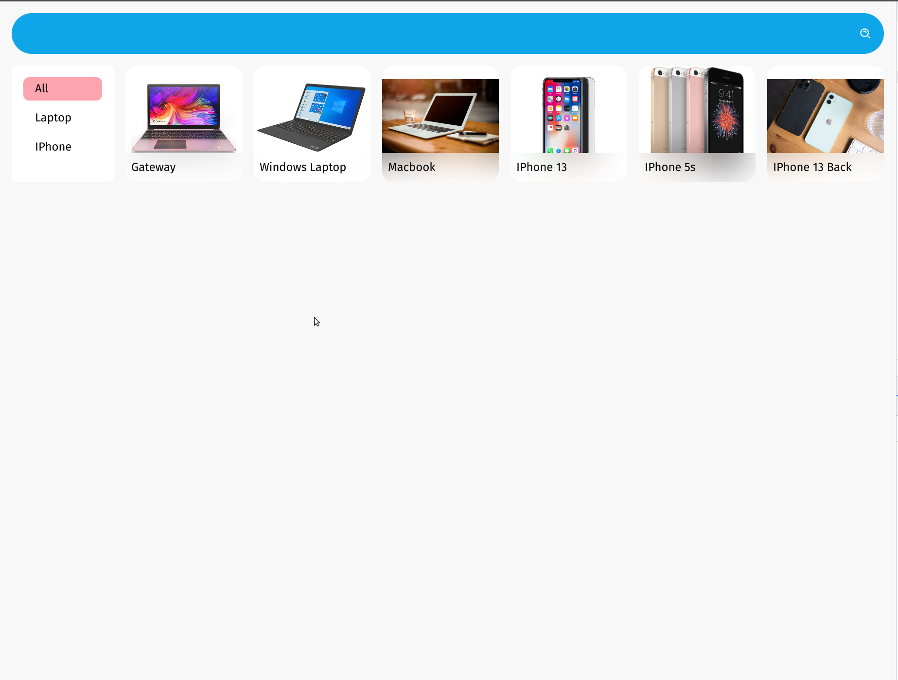
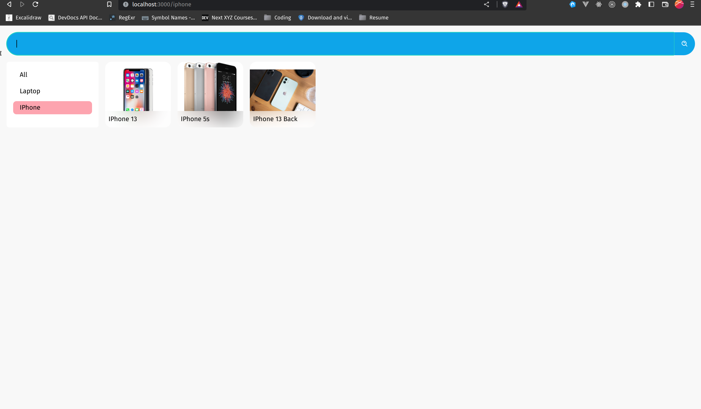

# Image Search




# Filters!
## Backend
### Sonati
```python
class ImageSearch(mixins.ListModelMixin,viewsets.GenericViewSet):
    serializer_class = ImageSerializer
    permission_classes = []

    def get_queryset(self):
        q = self.request.GET.get('q')
        objs = Image.objects.all()
        if q is not None:
            objs = objs.filter(name__icontains=q)
        return objs
```

### Sanati
```python
# install django-filters
from django.shortcuts import render
from rest_framework import mixins,viewsets
from rest_framework.filters import SearchFilter

from img_app.models import Image
from img_app.serializers import ImageSerializer


class ImageSearch(mixins.ListModelMixin,viewsets.GenericViewSet):
    serializer_class = ImageSerializer
    permission_classes = []
    filter_backends = [SearchFilter, DjangoFilterBackend]
    filterset_fields = ['status',]

    queryset = Image.objects.all()

```

## Frontend

### Filtering data on fetch
```jsx

  const [data, setData] = useState()
  const [search, setSearch] = useState('');
  const load = async () => {
    try {
      const response = await axios.get('http://localhost:8000', );
      setData(response.data.filter(item => item.name.toLowerCase().includes(search.toLowerCase())))
    } catch(e) {
      console.log(e)
    }
  }

  useEffect(() => {
    load()
  }, [])

  <div className='block columns-5'>
    {data.map(image => {
      return <div></div>
    })}

  </div>

```
### Filtering data when looping
```jsx

  const [data, setData] = useState()
  const [search, setSearch] = useState('');
...
  <div className='block columns-5'>
    {data.filter(item => item.name.toLowerCase().includes(search.toLowerCase())).map(image => {
      return <div></div>
    })}

  </div>

```
### Filtering using useMemo
```jsx

  const [data, setData] = useState()
  const [search, setSearch] = useState('');
  ...

  const filteredData = useMemo(() => data.filter(item => item.name.toLowerCase().includes(search.toLowerCase())), [data])

  <div className='block columns-5'>
    {filteredData.map(image => {
      return <div></div>
    })}

  </div>

```


## when we have few pic we use abovr frontend otherwise:
```jsx
const [search, setSearch] = useState('');
// q : backend , search : state
const response = await axios.get('http://localhost:8000',{params:{q:search}} );


```
## form handle with click btn & Enter

```jsx
  <form className='flex flex-row group' onSubmit={(e)=>load(e)}>
        
</form>

// form refesh bydefault
//  ? load with e & not e 
const load = async (e) => {
    e?.preventDefault()
  
  }
```

## List Category:
```jsx
// list category
const categoryload = async (e) => {
  e?.preventDefault()
  try {
    const response = await axios.get('http://localhost:8000/cat/' );
    setCat(response.data)
  } catch(e) {
    console.log(e)
  }
}
useEffect(() => {
  categoryload()
}, [])

<div >
  {cat.map(cati=> <button onClick={()=>selectCategory(cati)}>{cati.name}</button>)}
</div>

```

## Select Category:
```python
class ImageSearch(mixins.ListModelMixin,viewsets.GenericViewSet):
    ...
    def get_queryset(self):
        q, cat = self.request.GET.get('q'), self.request.GET.get('cat') # add category filter

        objs = Image.objects.all()

        if q is not None:
            objs = objs.filter(name__icontains=q)
        if cat is not None:
            objs = objs.filter(categories__in=[cat])
        return objs
```
```jsx

  const selectCategory =async (cati)=>{
    try {
      const response = await axios.get('http://localhost:8000/',{params:{cat:cati.id}} );
      setData(response.data)
    } catch(e) {
      console.log(e)
    }
  }

  {cat.map(cati=> <button onClick={()=>selectCategory(cati)}>{cati.name}</button>)}


```

## Include search in category filter
```jsx

  const selectCategory =async (cati)=>{
    try {
      const response = await axios.get('http://localhost:8000/',{params:{cat:cati.id,q:search}} );
      setData(response.data)
    } catch(e) {
      console.log(e)
    }
  }

  {cat.map(cati=> <button onClick={()=>selectCategory(cati)}>{cati.name}</button>)}


```

## Showing the selected category
```jsx
const [selected,setSelected] =  useState() 
const selectCategory =async (cati)=>{
  setSelected(cati.id)
  ...
}

{cat.map(cati=> <button className={`... ${selected == cati.id? 'bg-rose-300' : ''}`} onClick={()=>selectCategory(cati)}>{cati.name}</button>)}

```

## Include category in search
```jsx
const [selected,setSelected] =  useState() 
...
const load = async (e) => {
  ...
    const response = await axios.get('http://localhost:8000',{params:{q:search,cat:selected}} );
    setData(response.data)
  ...
}


...
const selectCategory =async (cati)=>{
  setSelected(cati.id)
  ...
}

{cat.map(cati=> <button onClick={()=>selectCategory(cati)}>{cati.name}</button>)}

```

