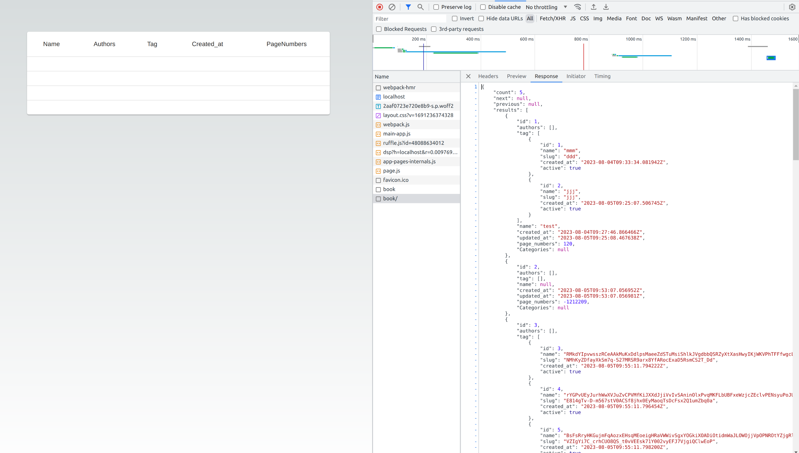
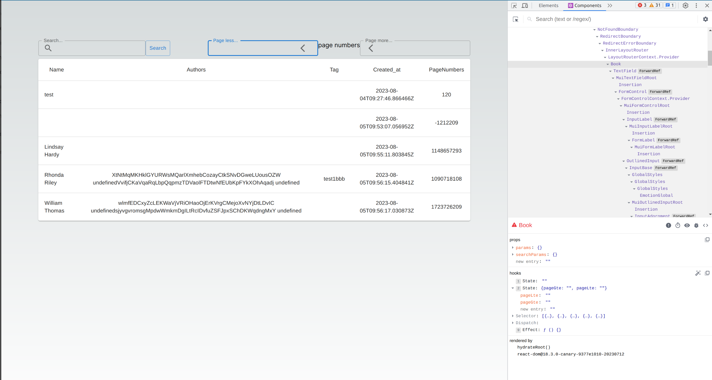
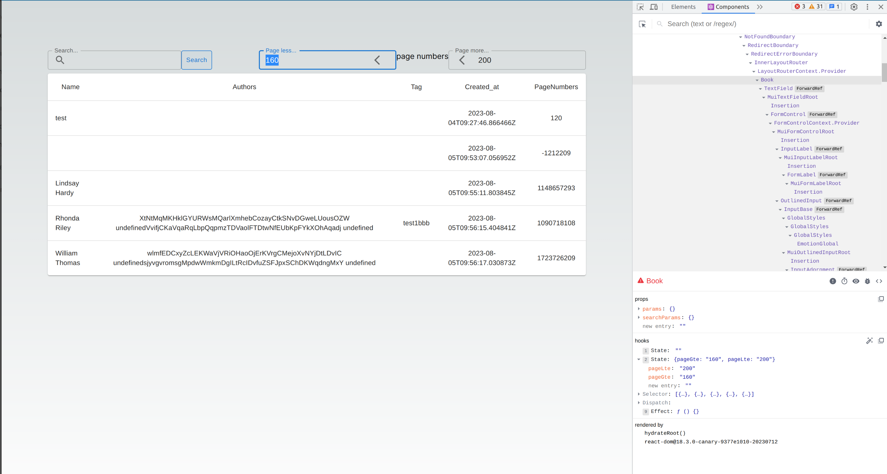
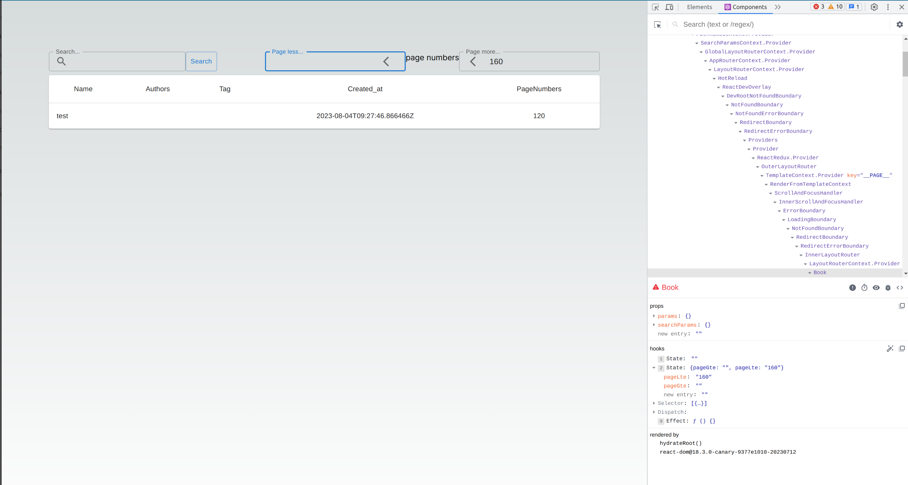
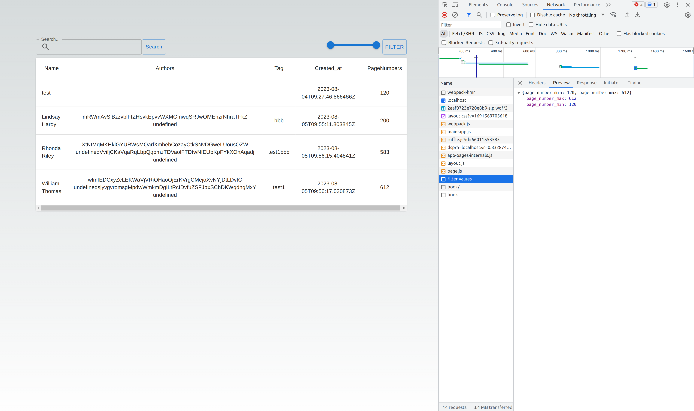
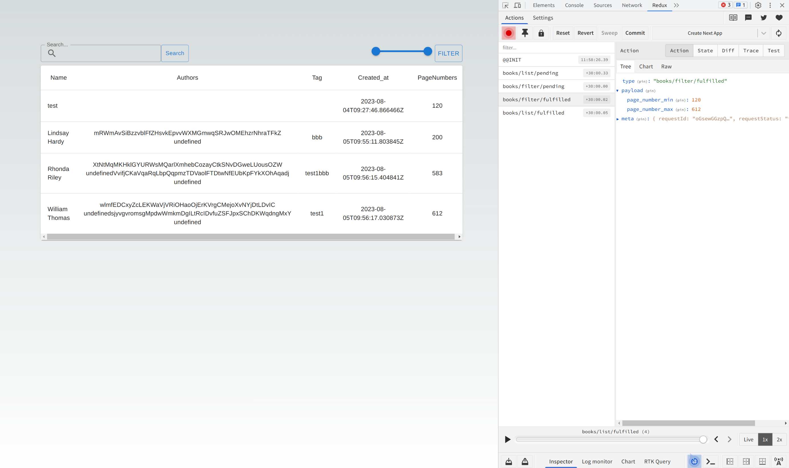
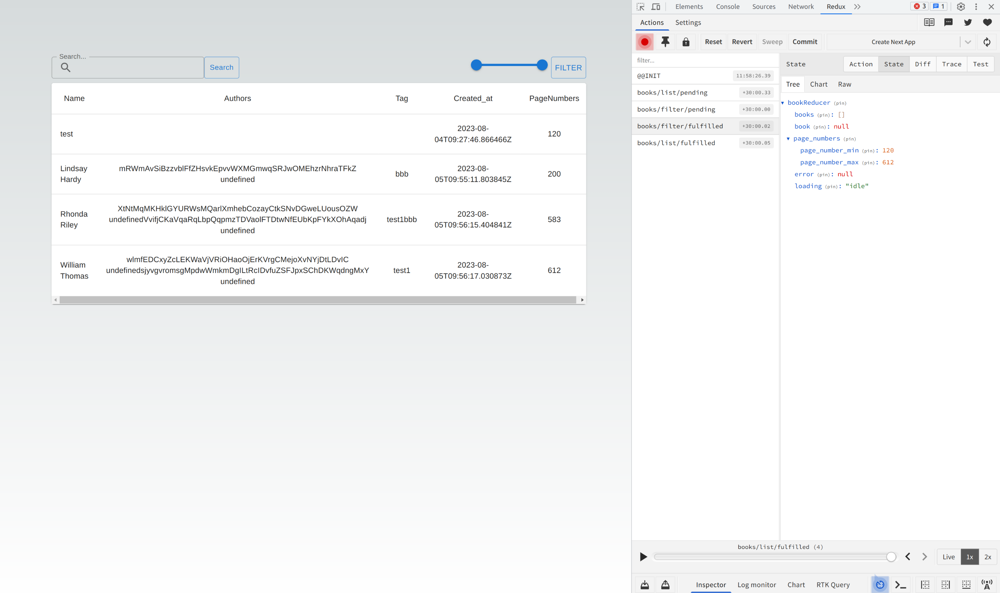
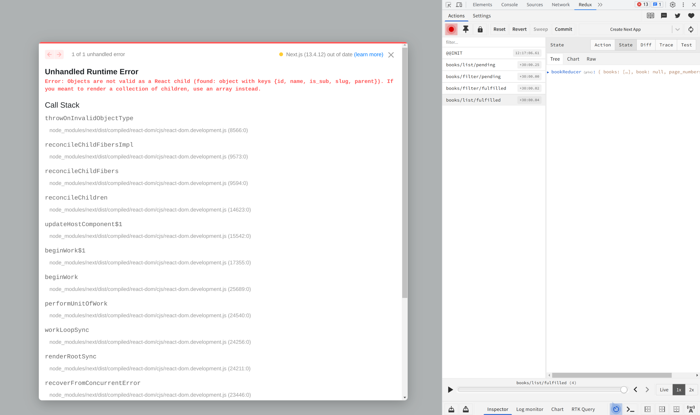
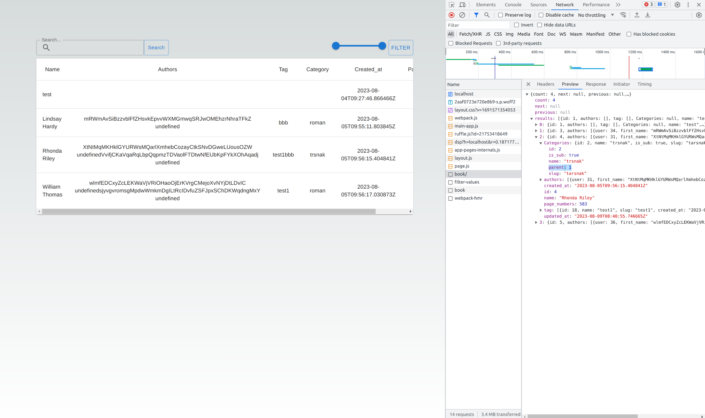
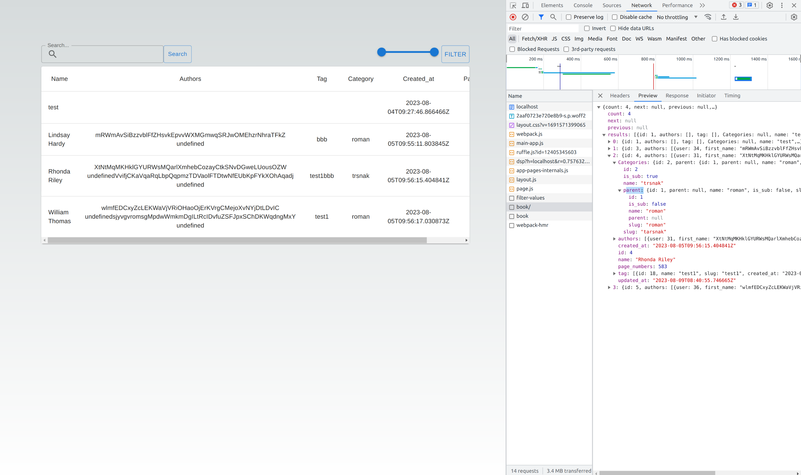

```bash
# next-app
npx create-next-app frontend
npm rub dev

```

## instLL


## Tailwind

[Tailwind cheetsheet](https://tailwindcomponents.com/cheatsheet/)

##

```jsx
const useState (initialState) =>{
  return [state,setState]
}

```

## axios

```jsx
npm install axios
import axios from 'axios';

const [books,setBooks] = useState([])
const listBooks =async()=>{
    const response = await axios.get('127.0.0.1:8000/api/books/book')
    setBooks(response.data)
  }
useEffect(()=>{listBooks() },[])


```

## python manage.py runserver

## error address without http

```bash
xhr.js:251     GET http://localhost:3000/127.0.0.1:8000/api/books/book 404 (Not Found)
```

### http at the first

```bash

const response = await axios.get('http://127.0.0.1:8000/api/books/book')

```

## error

```bash
localhost/:1 Access to XMLHttpRequest at 'http://127.0.0.1:8000/api/books/book' from origin 'http://localhost:3000' has been blocked by CORS policy: No 'Access-Control-Allow-Origin' header is present on the requested resource
```

## cross origin => backend

```python
const response = await axios.get('http://localhost:8000/api/books/book')
# install
pip install django-cors-headers

INSTALLED_APPS = [
    'jazzmin',
   ...
    'corsheaders',
    'rest_framework',
    'task',
]

MIDDLEWARE = [
    ...
    'corsheaders.middleware.CorsMiddleware', # cros
    'django.middleware.common.CommonMiddleware',
    ...
]
REST_FRAMEWORK = {
    'DEFAULT_AUTHENTICATION_CLASSES': (
        'rest_framework.authentication.BasicAuthentication', # CSRF Token missing

    )
}
## cross


CORS_ORIGIN_ALLOW_ALL = True
CORS_ALLOW_ALL_ORIGINS = True
CORS_ALLOW_CREDENTIALS = True

```

## response



## Error


```jsx
const [books,setBooks] = useState({results:[]})
{books.results.map((item) => ())}


or
// setBooks(response.data.results)

 const listBooks =async()=>{
    const response = await axios.get('http://localhost:8000/api/books/book')
    setBooks(response.data.results)
  }
```

## redux

```bash
npm i redux react-redux redux-persist redux-thunk @reduxjs/toolkit next-redux-wrapper

```

### Setup Redux

## 1. store.js

```jsx
store => handling redusers,state and actions
making Slice
```

## src/redux/store.js

```jsx
// Create a new folder in src/ called redux
// src/
//  |-- app/
//  |-- redux/

// src/redux/store.js

// https://codevoweb.com/setup-redux-toolkit-in-nextjs-13-app-directory/?utm_content=cmp-true
import { configureStore } from "@reduxjs/toolkit";

export const store = configureStore({
  reducer: {},
  devTools: process.env.NODE_ENV !== "production",
  middleware: (getDefaultMiddleware) =>
    getDefaultMiddleware({ serializableCheck: false }).concat(thunk), // dont send func in action payload
});
```

## devTools: process.env.NODE_ENV !== "production",


```jsx
if env is production ,show state with devTools

```

## map


```jsx
 {books.map((item,index) => (
   <TableRowkey={item.name} >
     <TableCell component="th" scope="row">
         {item.name}
     </TableCell>
     //map on  author
     <TableCell align="center">{item.authors.map((author)=>{
       `${author.first_name} ${author.lastt_name}`
     })}</TableCell>

     //map on tag

    <TableCell align="center">{item.tag.map((tag)=>{
       `${tag.name}`
    })}</TableCell>))}
```

### error with out return for up maps

1.  return
2.  ()

```jsx
<TableCell align="center">
  {item.authors.map((author) => {
    return `${author.first_name} ${author.lastt_name}`;
  })}
</TableCell>
```

### Showing the first few tags

```jsx
let tags = [{ name: "a" }, { name: "b" }, { name: "c" }];
tags.map((tag) => tag.name);
// out => ['a', 'b', 'c']
tags.map((tag) => tag.name)[0];
// out => 'a'
```

```jsx
// array[0]
{
  item.tag.map((tag, index) => {
    return tag.name;
  })[0];
}

// index
{
  item.tag.map((tag, index) => {
    return index < 1 ? `${tag.name} ` : undefined;
  });
}

// filter
<TableCell align="center">
  {item.authors
    .filter((_, index) => index < 1)
    .map((author) => {
      return `${author.first_name} ${author.lastt_name}`;
    })}
</TableCell>;
```

## 2.provider.jsx

```jsx
provider registers redux context

```

```jsx
// src/redux/provider.jsx
"use client";

import { store } from "./store";
import { Provider } from "react-redux";

export function Providers({ children }) {
  // sore => return func store.js
  return <Provider store={store}>{children}</Provider>;
}

// src/app/layout.js
export default function RootLayout({ children }) {
  return (
    <html lang="en">
      <body className={inter.className}>
        <Providers>{children}</Providers> {/* Add this line */}
      </body>
    </html>
  );
}
```

## 3.

## action is object with type,payload

## rest : reset to factory for showing initial state

## builder for extra reducer => builder with state,action

```jsx
// src/app/pages =>
// loadBooks from  src/redux/slices/books.js
const dispatch = useDispatch();
const booksList = async () => {
  await dispatch(loadBooks()).unwrap();
};
useEffect(() => {
  booksList();
}, []);

// src/redux/slices/books.js
```

### 1.

```jsx
const internalInitialState = {
  books: [],
  book: null,
  error: null,
  loading: IDLE, // false ,not busy
};
```

### 2.

```jsx
export const bookSlice = createSlice({
  name: "book",
  initialState: internalInitialState,
  reducers: {
    reset: () => internalInitialState,
  },
  extraReducers: (builder) => {
    // loadbooks
    builder.addCase(loadBooks.pending, (state) => ({
      ...state,
      loading: LOADING,
    }));
    builder.addCase(loadBooks.rejected, (state, action) => ({
      ...state,
      loading: IDLE,
      error: action.payload.error,
    }));
    builder.addCase(loadBooks.fulfilled, (state, action) => {
      state.loading = IDLE;
      //total data => action.payload.data
      //up => {...respose.data } or response.data => action.payload
      state.books = action.payload.data.results;

      return state;
    });
  },
});
```

## fulfilled

### action.payload.data.results


### 3.

```jsx
export const loadBooks = createAsyncThunk(
  "books/list",
  async (payload, thunkAPI) => {
    try {
      const response = await axios.get(`http://localhost:8000/api/books/book`);

      console.log(response, response.data);

      return response;
    } catch (error) {
      return thunkAPI.rejectWithValue({ error: error });
    }
  }
);
```


## state.books = action.payload.results;

```jsx
export const loadBooks = createAsyncThunk(
  'books/list',
  async (payload, thunkAPI) => {

    try {
     ...
      return response.data;
    }
    ...
  },
);
// state.books = action.payload.results;

  builder.addCase(loadBooks.fulfilled, (state, action) => {
      ...
      state.books = action.payload.results;

     ...
    });

```


## icons mui

```bash
npm install @mui/icons-material
```

## Search

- def state for getting data from user

```jsx
const [search, setSearch] = useState("");
```

- add a text field with value/onChange

```jsx
<TextField
  label="Search..."
  value={search}
  onChange={(e) => setSearch(e.target.value)}
/>
```

- Add search icon

```jsx
<TextField
  label="Search..."
  value={search}
  onChange={(e) => setSearch(e.target.value)}
  // icon search
  InputProps={{
    startAdornment: (
      <InputAdornment position="start">
        <SearchIcon />
      </InputAdornment>
    ),
  }}
/>
```
- Add search button
- Add onclick for button
- Call bookList on onClick
```jsx

 <TextField
            label="Search..."
            value={search}
            onChange={(e) => setSearch(e.target.value)}

          />
          <Button
            variant="outlined"
            size="small"
            className=" "
            onClick={() => booksList(search)}
            style={{
              textTransform: "none",
            }}
          >
            Search
          </Button>
```
- In redux, sync payload to params

```jsx

export const loadBooks = createAsyncThunk(
  'books/list',
  async (payload, thunkAPI) => {

    try {
      const response = await axios.get(`http://localhost:8000/api/books/book`,{params:payload});
   ...
    }
  },
);


```

- Add search to payload => `loadBooks({ search,})`
- this is frontend search state, in backend the values comes from SearchFilter class => search
- Clear text when user clicks on close
```jsx
  <TextField
           
            InputProps={{
              
              endAdornment: (
                <InputAdornment position="end">
                  {/* clear search */}
                  {search && (
                    <IconButton
                      onClick={() => {
                        setSearch("");
                      }}
                    >
                      <CloseIcon className="text-base" />
                    </IconButton>
                  )}
                </InputAdornment>
              ),
            }}
            size="small"
            className="flex-grow md:flex-grow-0 "
          />
```
### ISSUE: List doesn't update when data is cleared

- Add bookList function in the onclick next to setSearch

```jsx
  <IconButton onClick={() => {
    setSearch("");
    booksList() // call bookList again
  }}>
```

### ISSUE: In bookList, search state is not updated in time

bookList is called, but it has the previous search value

```jsx
const booksList =async(search)=>{ // Get search from params
  try {
    await dispatch(loadBooks({ search,})).unwrap()
    // console.log(reset({ treset: 123}));
  }
  catch(e){
  console.log("error")
  }
}

<IconButton onClick={() => {
    setSearch("");
    booksList("") // new search value
  }}>


<Button
  variant="outlined"
  size="small"
  className="p-1 "
  onClick={() => booksList(search)} {/* Send the search state to bookList */}
>
  Search
</Button>

```

## Search


## Filter

- Create a filter state

```jsx
const [filter, setFilter] = useState({
  pageLte: "",
  pageGte: "",
});
```



- Add onChange

```jsx
<TextField
  label="Page more..."
  value={filter.pageLte}
  onChange={(e) => setFilter({ ...filter, pageLte: e.target.value })}
/>
```



- Add onClick

```jsx
<IconButton
  onClick={() => {
    booksList();
  }}
>
  {" "}
  <ArrowBackIosIcon />
</IconButton>
```

- Update bookList filters

```jsx
await dispatch(
  loadBooks({
    // search
    search,
    //filter
    page_numbers__lte: filter.pageLte,
    page_numbers__gte: filter.pageGte,
  })
).unwrap();
```




## Filter with slider
```jsx
1.initial State is Array and in booklist =>  page_numbers__lte: filter[1],
const [filter, setFilter] = useState([0,1000])

2.
 const handleChange = (event, newValue) => {
    setFilter(newValue);
  };
   <Slider
       
        value={filter}
        onChange={handleChange}
        valueLabelDisplay="auto"
        // getAriaValueText={valuetext}
        disableSwap
        max={1000}
      />
3.
   <Button
      variant="outlined"
      onClick={() => {  booksList();  }} >Filter</Button>

4.
 const booksList = async (anything) => {
    try {
      await dispatch(
        loadBooks({
          // search
          search: anything,
         
         //filter
          page_numbers__lte: filter[1],
          page_numbers__gte: filter[0],
        })
      ).unwrap();
    } catch (e) {
      console.log("error");
    }
  };
  5.cahange default slider

 max={1000}

```
## pointer example for setFilter
```jsx
 const x = () => {
    // ../
  }
  new Promise().then(x)
```
 
 ## filter with backend
 ```jsx
//  1.
//  get min,max page from backend 
 class FilterPageNumbers(APIView):
    def get(self,request,**kwargs):
        page_number_min = 10000000000
        page_number_max = 0
        for book in Book.objects.all():
            page_number_min = min(page_number_min, book.page_numbers)
            page_number_max = max(page_number_max, book.page_numbers)

        return Response(data={
            "page_number_min":page_number_min,
            "page_number_max": page_number_max,
        },status=status.HTTP_200_OK)
// 2.
// state
  const [filter, setFilter] = useState([])
// redux

export const filterBooks = createAsyncThunk(
  'books/filter',
  async (payload, thunkAPI) => {

    try {
      const response = await axios.get(`http://localhost:8000/api/books/filter-values`);

      console.log(response, response.data);

      return response.data;
    } catch (error) {
      return thunkAPI.rejectWithValue({ error: error });
    }
  },
);
// 
const internalInitialState = {

  page_numbers:{},

  
};

// 
    builder.addCase(filterBooks.fulfilled, (state, action) => {
      state.loading = IDLE;
     
      state.page_numbers = action.payload;
      
      return state;
    });

  // 3.
    // filter
  const page_numbers = useSelector((state) => state.bookReducer.page_numbers);

  const pageBook = async () => {
    try {
      const resp = await dispatch(
        filterBooks()
      ).unwrap();
      // min,max
      setFilter([
        resp.page_number_min,
        resp.page_number_max,
      ])
    } catch (e) {
      console.log("error");
    }
  };
  useEffect(() => {
    pageBook();
  }, []);
// 4.
 <Slider
   
        max={page_numbers.page_number_max}
        min={page_numbers.page_number_min}
      />
// 5.fix value of filter

  const booksList = async (anything) => {
    try {
      await dispatch(
        loadBooks({
          // search
          search: anything,
        

         //filter
          page_numbers__lte: filter[1],
          page_numbers__gte: filter[0],
        })
      ).unwrap();
      // console.log(reset({ treset: 123}));
    } catch (e) {
      console.log("error");
    }
  };
 ```


 ### useEffect
 
 ### action
 
 ### state
 


 ## add Category Field

 ```python
#  admin
 class Categorydmin(admin.ModelAdmin):
    search_fields = ('name',
                     )
    list_display = ['name',
                  ]
    ordering = ('name', )
    fields = None

 admin.site.register(Category,Categorydmin)


 class BookAdmin(admin.ModelAdmin):
    search_fields = ('authors', 'name', 
                     'created_at', 'page_numbers')
    list_display = [  'name','created_at', 'page_numbers', 'Categories','author_field','tag_field'
                  ]
    ordering = ( 'name', )
    fields = None

# serializers
class BookSerializer(serializers.ModelSerializer):
    authors = AuthorSerializer(many=True)
    tag = TagSerializer(many=True)
    Categories = CategorySerializer()
    class Meta:
        model = Book
        fields = "__all__"

 
 ```
  

  ```jsx
 <TableCell align="center">{item.Categories.name}</TableCell>

  ```
  


 ```jsx
 
<TableCell align="center">{item.Categories?.name}</TableCell>

 
 ```

 ## Category parent
 

```python
# serializers
class CategorySerializer(serializers.ModelSerializer):
    parent = SerializerMethodField()

    class Meta:
        model = Category
        fields = "__all__"

    def get_parent(self, obj):
        if obj.parent is not None:
            return CategorySerializer(obj.parent).data
        else:
            return None

```




## Filter category
```python
# views.py
class CategoryView(mixins.ListModelMixin, mixins.RetrieveModelMixin, viewsets.GenericViewSet):
    serializer_class = CategorySerializer
    permission_classes = []
    filter_backends = [ SearchFilter]
    search_fields = ['name']
    queryset = Category.objects.all()

# urls.py
router.register(r'category', views.CategoryView, basename='categories')

```

```jsx
1. 
// redux/slices/book.js

export const categoryBooks = createAsyncThunk(
  'books/categories',
  async (payload, thunkAPI) => {

    try {
      const response = await axios.get(`http://localhost:8000/api/books/category`);

      console.log(response, response.data);

      return response.data;
    } catch (error) {
      return thunkAPI.rejectWithValue({ error: error });
    }
  },
);

const internalInitialState = {
  ...
  categories:[],
  ...
};

// categoryBooks
builder.addCase(categoryBooks.pending, (state) => ({
  ...state,
  loading: LOADING,
}));
builder.addCase(categoryBooks.rejected, (state, action) => ({
  ...state,
  loading: IDLE,
  error: action.payload.error,
}));
builder.addCase(categoryBooks.fulfilled, (state, action) => {
  state.loading = IDLE;

  state.categories = action.payload;
  
  return state;
});

2. 
// app/page.js
const categories = useSelector((state)=>state.bookReducer.categories)
const categorylist = async () => {
  try {
    await dispatch(
      categoryBooks()
    ).unwrap();
    
  } catch (e) {
    console.log("error");
  }
};
useEffect(() => {
  categorylist();
}, []);


3.
const [filterCategory, setFilterCategory] = useState()

<FormControl className="w-40">
  <InputLabel id="demo-simple-select-label">Category</InputLabel>
  <Select
    labelId="demo-simple-select-label"
    id="demo-simple-select"
    value={filterCategory}
    label="Category"
    onChange={(e)=>setFilterCategory(e.target.value)}
  >
...    
  </Select>
</FormControl>


4.
<FormControl className="w-40">
  <InputLabel id="demo-simple-select-label">Category</InputLabel>
  <Select
    ...
  >
  {categories?.map((cat)=><MenuItem value={cat.id} key={cat.id}>{cat.name}</MenuItem>)}  
    
  </Select>
</FormControl>

5.
const booksList = async (anything) => {
  try {
    await dispatch(
      loadBooks({
        ...
        //category
        Categories:filterCategory,
      })
    ).unwrap();
    // console.log(reset({ treset: 123}));
  } catch (e) {
    console.log("error");
  }
};

6. Unselect
<FormControl className="w-40">
  <InputLabel id="demo-simple-select-label">Category</InputLabel>
  <Select
    ...
  >
    <MenuItem>All</MenuItem>
  {categories?.map((cat)=>...)}  
    
  </Select>
</FormControl>

```

## Filter author(MTM)

### Getting author list
```python
class AuthorView(mixins.ListModelMixin,mixins.RetrieveModelMixin,viewsets.GenericViewSet):
    serializer_class = AuthorSerializer
    permission_classes = []
    queryset = Author.objects.all()

```

```jsx
1.
export const authorBooks = createAsyncThunk(
  'books/authors',
  async (payload, thunkAPI) => {

    try {
      const response = await axios.get(`http://localhost:8000/api/authors/author`);

      console.log(response, response.data);

      return response.data;
    } catch (error) {
      return thunkAPI.rejectWithValue({ error: error });
    }
  },
);

2.
const internalInitialState = {
  ...
  authors:[],
};

3.
// categoryBooks
builder.addCase(authorBooks.pending, (state) => ({
  ...state,
  loading: LOADING,
}));
builder.addCase(authorBooks.rejected, (state, action) => ({
  ...state,
  loading: IDLE,
  error: action.payload.error,
}));
builder.addCase(authorBooks.fulfilled, (state, action) => {
  state.loading = IDLE;

  state.authors = action.payload;
  
  return state;
});

4.
const authors = useSelector((state) => state.bookReducer.authors);
const authorsList = async () => {
  try {
    await dispatch(authorBooks()).unwrap();
  } catch (e) {
    console.log("error");
  }
};
useEffect(() => {
  authorsList();
}, []);

5.
{/* author */}
const [filterAuthor, setFilterAuthor] = useState();
<FormControl className="w-40">
  <InputLabel id="demo-simple-select-label">Author</InputLabel>

  <Select
    labelId="demo-simple-select-label"
    id="demo-simple-select"
    value={filterAuthor}
    label="Category"
    onChange={(e) => setFilterAuthor(e.target.value)}
  >
    <MenuItem>All</MenuItem>
    {authors?.map((au) => (
      <MenuItem value={au.user} key={au.user}>
        {au.first_name}{' '}{au.last_name}
      </MenuItem>
    ))}
  </Select>
</FormControl>

6.
const booksList = async (anything) => {
  try {
    await dispatch(
      loadBooks({
        ...
        // author
        author: [filterAuthor],
      })
    ).unwrap();
  } catch (e) {
    console.log("error");
  }
};
```
### Filtering author
```python

# views.py
class BookView(mixins.ListModelMixin,mixins.RetrieveModelMixin,viewsets.GenericViewSet):

  def get_queryset(self):
      print(self.request.query_params.getlist('author[]'))
      author = self.request.query_params.getlist('author[]', [])

      if author is not None and author != "" and len(author) > 0 and author:
          print(author)
          return Book.objects.filter(authors__in=author)
      else:
          return Book.objects.all()


```

## Pagination
```jsx
1. Get count from redux
builder.addCase(loadBooks.fulfilled, (state, action) => {
  state.loading = IDLE;
  ...
  state.books = action.payload.results;
  state.count = action.payload.count; // response.data.count
  return state;
});

2.
const LIMIT = 10;
const count = useSelector((state) => state.bookReducer.count);
const [page,setPage] = useState(1);
const number_of_pages = Math.ceil(count/LIMIT)

<Pagination count={number_of_pages} page={page} onChange={(e,v)=>setPage(v)} color="primary" />

3.

const offset  = (page-1)*LIMIT
useEffect(() => {
  booksList();
}, [page]);

4.
const booksList = async (anything) => {
  try {
    await dispatch(
      loadBooks({
        ...
        // Pagination
        limit:LIMIT,
        offset:offset
      })
    ).unwrap();
  } catch (e) {
    console.log("error");
  }
};

```

#### Calculating offset
```
Count = 43
LIMIT = 10
page_number     1   2   3   4   5
Number of items 10  10  10  10  3
Previous pages  0   1   2   3   4
Previous items  0   10  20  30  40 // previous pages * limit
```

### 

### change filters and go to first page

```jsx
  useEffect(() => {
    booksList(search);
  }, [page, filterAuthor, filterCategory, filter]);

// slider
  const handleChange = (event, newValue) => {
    setFilter(newValue);
    setPage(1)
  };
// category
  <Select
      onChange={(e) => {
         setFilterCategory(e.target.value)
         setPage(1)
              }}
        >
            </Select>

// author
 <Select
            
   onChange={(e) => {
      setFilterAuthor(e.target.value)
      setPage(1)
              }}
            >
          
            </Select>

```