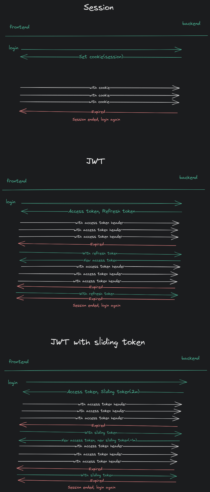

# Authentiction methods


# Handling cross origin requests

```python
# pip install django-cors-headers
INSTALLED_APPS = [
    'jazzmin',
   ...
    'corsheaders',
    'rest_framework',
    'task',
]

MIDDLEWARE = [
    ...
    'corsheaders.middleware.CorsMiddleware', # cros
    'django.middleware.common.CommonMiddleware',
    ...
]
REST_FRAMEWORK = {
    'DEFAULT_AUTHENTICATION_CLASSES': (
        'rest_framework.authentication.BasicAuthentication', # CSRF Token missing

    )
}
CORS_ALLOWED_ORIGINS = [
    'http://localhost:3000' # Allow-Origin... cannot be wildcart '*'
]
CORS_ALLOW_CREDENTIALS = True # Allow-Credentials...

```