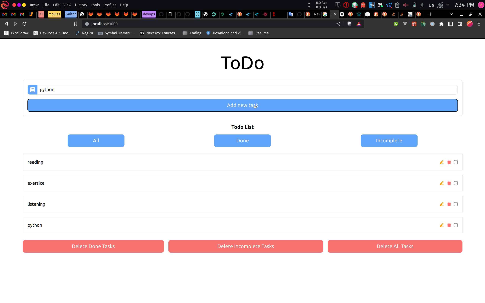

# Tailwind

```bash
npm install -D tailwindcss postcss autoprefixer
npx tailwindcss init -p
```

```js
// tailwind.config.js
module.exports = {
  content: [
    "./pages/**/*.{js,ts,jsx,tsx}",
    "./components/**/*.{js,ts,jsx,tsx}",
  ],
  theme: {
    extend: {},
  },
  plugins: [],
};
```

```css
/* globals.css */
@tailwind base;
@tailwind components;
@tailwind utilities;
```

# React icons

```bash
npm i react-icons
```

# Redux

```bash
npm i redux react-redux redux-persist redux-thunk @reduxjs/toolkit next-redux-wrapper
```

# Axios

```bash
npm i axios
```

# Decorators(Wrappers in JS)

1. Without wrapper

```js
const myFunc = () => {
  let sum = 0;
  for (let i = 0; i < 1e6; i++) {
    sum += i;
  }
  return sum;
};
const myFunc2 = () => {
  let sum = 0;
  for (let i = 0; i < 1e6; i++) {
    sum += i;
  }
  return sum;
};

const logger1 = () => {
  console.log("Started");
  ret = myFunc();

  console.log("Finished");

  return ret;
};

const logger2 = () => {
  console.log("Started");
  ret = myFunc2();

  console.log("Finished");

  return ret;
};
```

2. With Wrapper

```js
const logger = (func) => {
  return () => {
    console.log("Started");
    ret = func();

    console.log("Finished");

    return ret;
  };
};

const myFunc = logger(() => {
  let sum = 0;
  for (let i = 0; i < 1e6; i++) {
    sum += i;
  }
  return sum;
});
const myFunc2 = logger(() => {
  let sum = 0;
  for (let i = 0; i < 1e6; i++) {
    sum += i;
  }
  return sum;
});
```

### reducer worked with action & state

action.type => run your reducer(func)

rootReducer =>(action.type === HYDRATE) else combinedReducers => run your slice

### cross origin

### backend

```python

INSTALLED_APPS = [
    'jazzmin',
   ...
    'corsheaders',
    'rest_framework',
    'task',
]

MIDDLEWARE = [
    ...
    'corsheaders.middleware.CorsMiddleware', # cros
    'django.middleware.common.CommonMiddleware',
    ...
]
REST_FRAMEWORK = {
    'DEFAULT_AUTHENTICATION_CLASSES': (
        'rest_framework.authentication.BasicAuthentication', # CSRF Token missing

    )
}
CORS_ALLOWED_ORIGINS = [
    'http://localhost:3000' # Allow-Origin... cannot be wildcart '*'
]
CORS_ALLOW_CREDENTIALS = True # Allow-Credentials...

```

## create

```js
// cosole/network
{
  "id":6,
  "title":"test",
  "created_at":"2022-11-30T14:40:38.012954Z",
  "updated_at":"2022-11-30T14:40:38.012982Z",
  "status":"incomplete"
}
// admin django
```

```jsx
const [title,setTitle]= useState("")
...
await dispatch(create( { title:title } )).unwrap()
...

// data = { title: '...' }
// data => object
// data.title => string
// ...data => expand data
export const create = createAsyncThunk(
  'task/create',
  async (data, thunkAPI) => {
    try {
      const response = await axios.post(`/task/tasks/`,{ ...data });
      // const response = await axios.post(`/task/tasks/`,{ ...data, status: 'incomplete' });
      // const response = await axios.post(`/task/tasks/`, data);

      console.log(response, response.data);

      return { data: response.data };
    } catch (error) {
      console.log(error);
      return thunkAPI.rejectWithValue({ error: error.response.data });
    }
  },
);
```